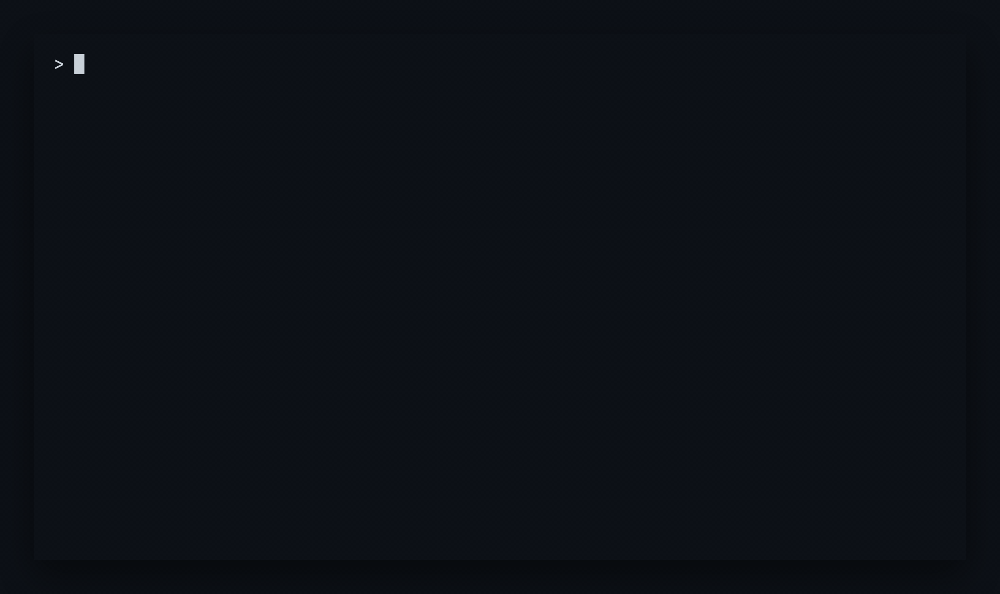

# Skills Manager

[](https://github.com/akunzai/skills-manager/actions/workflows/ci.yml)
[](LICENSE)

One source of truth for skills across Claude Code, Codex, Google Antigravity CLI, and other coding agents.

Skills Manager installs skills once, records the result in `skills.json`, and keeps each agent's availability in sync. It ships as a standalone Go binary and uses the system `git` only when a remote repository needs updating.

<p align="center">
  
</p>

## Install

macOS and Linux:

```sh
curl -fsSL https://raw.githubusercontent.com/akunzai/skills-manager/main/install.sh | bash
```

Windows PowerShell:

```powershell
irm https://raw.githubusercontent.com/akunzai/skills-manager/main/install.ps1 | iex
```

## Start with one skill

```sh
skills add akunzai/agent-skills
skills ls
```

The interactive flow asks where the skill belongs and which agents should see it. For scripts and CI, provide the choices explicitly:

```sh
skills add akunzai/agent-skills --skill agents-md --agent claude --yes
```

`--agent` is persistent policy, not a one-time link. A later `skills sync` restores the same availability.

## Discovery scopes

Add the repository root by default. Equivalent copies of a Skill are collapsed
and the conventional `skills/<name>` path is preferred:

```sh
skills add microsoft/azure-skills
```

For precise discovery or automation, append a collection path or pass `--path`:

```sh
skills add microsoft/azure-skills/skills
skills add microsoft/azure-skills --path skills
```

GitHub tree URLs also set the branch and discovery scope. If same-name Skills
have different contents, interactive Add asks which Source path to use;
non-interactive Add requires an explicit scope.

## Global or project-local

Global is the default. Project mode keeps the declaration beside the code so a team can reproduce it after cloning.

| Scope | Command | Configuration | Installed skills |
| --- | --- | --- | --- |
| Global | `skills …` | `~/.agents/skills.json` | `~/.agents/skills/` |
| Project | `skills --project …` | `./.agents/skills.json` | `./.agents/skills/` |

```sh
skills --project init
skills --project add akunzai/agent-skills --skill agents-md
git add .agents/skills.json
```

Teammates restore the declared state with:

```sh
skills --project update
skills --project sync
```

`update` and `sync` are deliberately separate. Update uses the Project Config to refresh its declared remote Sources in the shared Cache; Sync then reconciles Project Skills from that Cache without network access. Materialized Project Skills are ordinary team-owned files—you decide whether to commit them.

## Control availability

Defaults cover the common case. Per-skill policy handles the exceptions without hand-editing JSON.

```sh
skills config
skills config set defaultAgents claude,antigravity

skills agents agents-md
skills agents agents-md include antigravity
skills agents agents-md exclude claude
skills agents agents-md follow-defaults
```

Universal agents that read the central skills directory directly do not need links and are reported separately.

## Daily commands

| Intent | Command |
| --- | --- |
| See installed and configured skills | `skills ls` |
| Reconcile the selected Scope from its existing Cache | `skills sync` |
| Preview reconciliation | `skills sync --dry-run` |
| Inspect remote → Cache → Scope freshness | `skills outdated` |
| Refresh remote Sources into the shared Cache | `skills update` |
| Diagnose drift | `skills doctor` |
| Repair diagnosed health issues | `skills doctor --fix` |
| Remove undeclared managed items | `skills prune` |
| Remove a skill | `skills rm <skill>` |
| Print or install AI agent guide | `skills guide [--install]` |

Every operational command accepts `--project`. Structured consumers can use `skills ls --json`; interactive terminals use standard Unicode marks, while redirected output and `TERM=dumb` fall back to plain text.

For remote Skills, the normal flow is `skills outdated`, `skills update`, then `skills sync`. Sync protects known local changes and unknown baselines; inspect them first, or explicitly overwrite with `skills sync --force`. `sync --dry-run` is a non-mutating freshness gate: it reports what Sync would do without writing anything, and without running a skill's own commands.

When upgrading from a legacy branchless Cache layout, `skills doctor --fix` may access the network to rebuild affected Cache entries; it does not run Sync automatically.

`skills sync`, `skills outdated`, and `skills doctor` share one set of exit codes: `0` when the Scope matches its Config, `1` when it does not, and `2` when the work could not be completed. A skill Sync deliberately left alone — protected local changes, an unknown baseline, an uncached Source — is reported as a blocked skill with a next action, and exits `1`. Only a genuine failure, such as a copy that did not complete or an agent path Sync does not manage, exits `2`. Doctor reads the same way: a finding it reports with a next action exits `1`, while Cache recovery artifacts or a repair that failed under `--fix` exit `2`. All three report state and next actions rather than command errors.

## Configuration

`skills init` creates a schema-backed `skills.json`. Most settings can be managed through `skills config` and `skills agents`; direct editing remains available with `skills config edit`.

```json
{
  "$schema": "https://raw.githubusercontent.com/akunzai/skills-manager/main/skills.schema.json",
  "version": 1,
  "settings": {
    "defaultAgents": ["claude-code"],
    "availability": {
      "agents-md": {
        "include": ["antigravity-cli"]
      }
    }
  },
  "remote": {
    "akunzai/agent-skills": {
      "type": "github",
      "skills": {
        "agents-md": "skills/agents-md"
      }
    }
  },
  "local": {}
}
```

See [`skills.schema.json`](skills.schema.json) for every field.

## More

- Run `skills <command> --help` for flags and examples.
