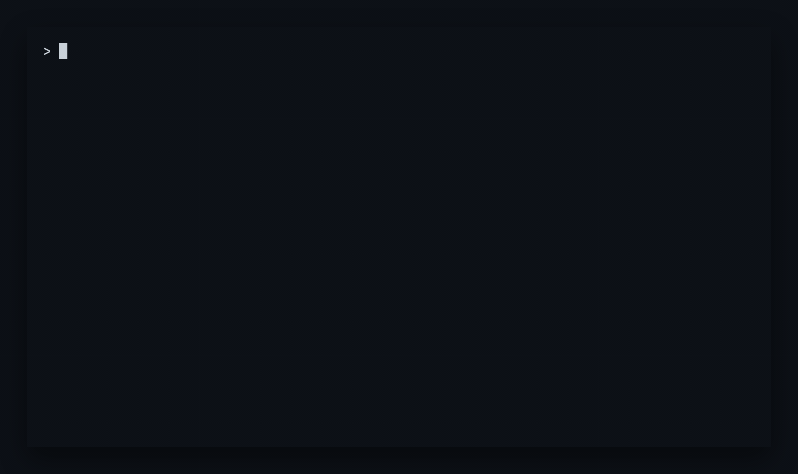

# Skills Manager

[](https://github.com/akunzai/skills-manager/actions/workflows/ci.yml)
[](https://codecov.io/gh/akunzai/skills-manager)
[](LICENSE)

One source of truth for skills across Claude Code, Codex, Google Antigravity CLI, and other AI agents.

Skills Manager installs skills once, records the result in `skills.json`, and keeps each agent's availability in sync. It ships as a standalone Go binary and uses the system `git` (2.35 or newer) only when a remote repository needs updating.

<p align="center">
  
</p>

## Install

```sh
curl -fsSL https://raw.githubusercontent.com/akunzai/skills-manager/main/install.sh | bash
```

Homebrew, Scoop, mise, the Windows PowerShell installer, and self-upgrade (`skills
self-update`) are in [docs/INSTALL.md](docs/INSTALL.md).

## Quick start

```sh
skills add akunzai/agent-skills
skills ls
```

The interactive flow asks where the skill belongs and which agents should see it. For scripts and CI, provide the choices explicitly:

```sh
skills add akunzai/agent-skills --skill agents-md --agent claude --yes
```

`--agent` is persistent policy, not a one-time link. A later `skills sync` restores the same availability.

## Docs

- [Usage](docs/USAGE.md) — discovery scopes, global vs. project, availability policy, and the daily command reference with its exit codes.
- [Configuration](docs/CONFIGURATION.md) — every `skills.json` field, with the schema.
- [Signed skills](docs/SIGNING.md) — signature verification, trust, and certificate chains.
- [Install](docs/INSTALL.md) — every install path, package managers, and self-upgrade.
- Run `skills <command> --help` for flags and examples.
